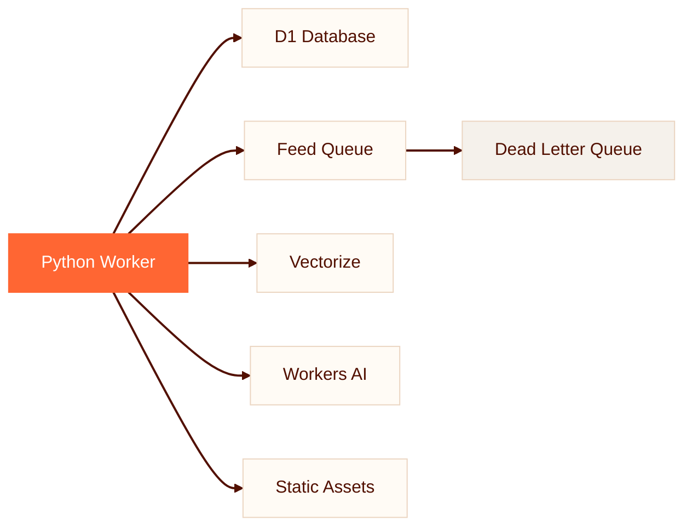

# Planet CF

A feed aggregator built on Cloudflare's Python Workers platform

<!--
Planet CF is a modern take on the classic "Planet" feed aggregator concept, rebuilt from scratch to run entirely on Cloudflare's edge infrastructure. The name echoes Planet Python, Planet Mozilla, and other community feed aggregators, but the implementation is fundamentally different: Python code running inside JavaScript's V8 engine via Pyodide/WASM.

Sources:
- https://github.com/adewale/planet_cf/blob/main/README.md -- project overview and description
-->

---
transition: fade
---

# What Is Planet CF?

An RSS/Atom feed aggregator where **Python runs inside V8 isolates** via Pyodide/WASM on Cloudflare's global edge network.

<v-clicks>

- One worker: scheduler, queue consumer, HTTP server, admin
- Hourly feed fetching with retries and dead-letter queue
- Semantic search via **Vectorize** and **Workers AI**
- On-demand HTML/RSS/Atom/OPML with 1-hour edge caching
- Multi-instance: Planet Python (500+) or Mozilla (190)

</v-clicks>

<!--
The key insight here is that this is not Python running alongside JavaScript -- it is Python running INSIDE JavaScript. Pyodide compiles CPython to WebAssembly, which runs inside V8 isolates on Cloudflare's edge. This means Python has no filesystem access, no threading, and no direct network I/O. Every external operation must cross the FFI boundary into JavaScript APIs. Despite these constraints, Planet CF handles feed parsing (feedparser), HTML sanitization (bleach), and template rendering (Jinja2) -- all in Python.

Sources:
- https://github.com/adewale/planet_cf/blob/main/README.md -- feature list and multi-instance examples
- https://github.com/adewale/planet_cf/blob/main/docs/ARCHITECTURE.md -- system topology and request flow
-->

---
transition: slide-up
---

# The Full Cloudflare Stack

A single worker orchestrates five Cloudflare primitives from Python.

Every binding -- database, queue, vector index, AI model -- is accessed through JavaScript APIs that return `JsProxy` objects, not Python types.

<!--
The architecture diagram shows the worker at the center, but the real story is in the arrows. Each arrow crosses the Python/JavaScript FFI boundary. D1 queries return JsProxy objects. Queue messages arrive as JsProxy. Vectorize results need conversion. Workers AI embeddings come back as JavaScript arrays. The worker wraps each binding in a SafeD1, SafeVectorize, SafeAI, or SafeQueue boundary class that converts types at the edge, keeping the core Python logic free of FFI concerns.

Sources:
- https://github.com/adewale/planet_cf/blob/main/docs/ARCHITECTURE.md -- system overview and binding topology
- https://github.com/adewale/planet_cf/blob/main/wrangler.jsonc -- D1, Vectorize, Queues, AI bindings
-->

---
layout: section
transition: iris
---

# Boundaries That Make It Work

Python inside JavaScript, made safe by a thin conversion layer

<!--
This section break introduces the core architectural insight of Planet CF: the boundary layer pattern. The through-line of this deck is that running Python inside JavaScript creates unique challenges at the type boundary, and the project's solution is a thin, disciplined conversion layer that quarantines all FFI complexity.
-->

---
transition: morph-fade
---

# `None` Is Not `None`

JavaScript `null` arrives in Python as `JsNull` -- a falsy value that is **not** Python `None`.

<v-clicks>

- `value is None` catches Python `None` only
- `JsNull` is falsy, but `JsNull is None` is `False`
- Three null-like values: `None`, `JsNull`, `JsUndefined`
- Every `if x is None` at the boundary is a lurking bug

</v-clicks>

**The fix:** `_is_js_undefined()` checks `type(x).__name__` at the boundary -- convert once at the edge, keep core logic pure Python.

<!--
This is the genuinely surprising finding from the project. Every Python developer's instinct is to check `if x is None`. In Pyodide, that check is subtly broken because JavaScript has two null-like values (null and undefined) that become JsNull and JsUndefined in Python -- neither of which is Python None. The project discovered this through production failures: mock tests passed because mocks use real Python None, but production code crashed on JsNull. The fix was a two-tier testing strategy: CPython mocks for logic, Pyodide fakes for FFI boundary verification.

Sources:
- https://github.com/adewale/planet_cf/blob/main/docs/LESSONS_LEARNED.md -- lesson 21: is None is never enough at the FFI boundary
- https://github.com/adewale/planet_cf/blob/main/docs/LESSONS_LEARNED.md -- lesson 17: Pyodide FFI type-compatibility matrix
-->

---
layout: fact
transition: fade
---

# 21

Hard-won lessons documented

Each traced to a specific production incident -- from JsProxy traps to deterministic E2E testing.

<!--
The LESSONS_LEARNED document is unusually comprehensive for a project of this size. Twenty-one lessons, each with a specific problem, symptom, and solution. Notable entries include: lesson 4 (templates must be embedded as Python strings because Workers have no filesystem), lesson 5 (hybrid search combining Vectorize semantic similarity with D1 keyword LIKE queries), lesson 9 (stateless sessions via HMAC-signed cookies because Workers are stateless), and lesson 19 (synchronous fetch-now endpoints that eliminate flaky sleep-based E2E tests). The document itself is an artifact of disciplined engineering practice.

Sources:
- https://github.com/adewale/planet_cf/blob/main/docs/LESSONS_LEARNED.md -- all 21 lessons
- https://github.com/adewale/planet_cf/blob/main/src/config.py -- 20+ smart defaults with sensible fallbacks
-->

---
layout: end
transition: fade
---

# Boundaries Create Reliability

Python inside JavaScript, made safe by a thin conversion layer.

<!--
The closing resolves the through-line: boundaries are not limitations but architectural strengths. The SafeD1, SafeVectorize, SafeAI wrappers quarantine all JsProxy complexity at the edge, keeping the core Python codebase testable with standard mocks. The boundary layer pattern -- convert everything at the edge, guarantee pure Python types in the core -- is the design decision that makes the project maintainable despite running in an unconventional runtime.
-->
