# Tasche

A self-hosted read-it-later service built on Cloudflare Python Workers

<!--
"Tasche" is German for "pocket." Let the subtitle land before saying anything else. The audience should understand what this is before you explain why it exists. The name signals a personal, portable knowledge store -- not a SaaS product, not a startup.

Sources:
- https://github.com/adewale/tasche/blob/main/README.md -- project description, first paragraph
-->

---
transition: fade
---

# Your reading list should not be someone else's business model

Save articles, read them offline, listen to them as audio -- all running in your own Cloudflare account.

<v-clicks>

- **Save articles by URL** with automatic content extraction
- **Full-text search** across your entire library via FTS5
- **Listen Later** -- generate audio via Workers AI TTS
- **Offline reading** -- PWA with service worker caching
- **Self-hosted** -- your data stays in your account

</v-clicks>

<!--
This slide explains what Tasche IS and WHY it exists. The title is the through-line provocation -- the reason this project exists at all. Pause after revealing "self-hosted" at the end. Every other read-it-later service holds your data hostage. Tasche does not. Pocket was acquired by Mozilla, then Mozilla laid off the team. Instapaper was acquired by Pinterest, then sold again. Your reading history should not depend on a company's survival.

Sources:
- https://github.com/adewale/tasche/blob/main/README.md -- feature list and project description
-->

---
layout: fact
transition: slide-up
---

# 6 Cloudflare services. 1 worker. $5/month.

Python Workers + D1 + R2 + KV + Queues + Workers AI

No external dependencies. No egress fees.

<!--
The $5/month figure is the Cloudflare Workers Paid plan as of early 2026. The free tier covers light personal use at 100K requests/day. The point is not the price -- it is the absence of hidden costs. No S3 bills, no database hosting, no third-party TTS API keys. Everything runs on one platform, one bill, one account.

Sources:
- https://github.com/adewale/tasche/blob/main/README.md -- cost section: "Requires the Cloudflare Workers Paid plan ($5/month as of early 2026)"
- https://github.com/adewale/tasche/blob/main/README.md -- architecture table listing all six bindings
-->

---
layout: section
transition: iris
---

# Every byte lives in your account

<!--
The through-line surfaces as an architectural claim. Pause here. The audience should feel the weight of "self-hosted" -- it is not a marketing label, it is a topology decision. D1 stores your articles and FTS5 index. R2 stores your archived HTML, images in WebP, and TTS audio. KV stores your sessions with a 7-day TTL. Queues handle async article processing. Nothing leaves your Cloudflare account. If Tasche the project disappears tomorrow, your data is still in your D1 database and R2 bucket, accessible through the Cloudflare dashboard.

Sources:
- https://github.com/adewale/tasche/blob/main/README.md -- architecture table: D1, R2, KV, Queues, Workers AI bindings
-->

---
transition: morph-fade
layout: center
---

# Python running inside JavaScript, not alongside it

Pyodide compiles CPython to WebAssembly inside V8 isolates

<v-clicks>

- No threads -- all handlers must be `async def`
- No C extensions -- pure Python or Pyodide-compatible only
- No `eval()` -- broke `python-readability`, forced a fallback
- The FFI boundary: convert at the edge, native Python everywhere else

</v-clicks>

<!--
This is the genuinely surprising constraint. Most developers assume "Python Workers" means a Python container or sidecar. It is actually Python compiled to WebAssembly running inside a JavaScript V8 isolate. This single architectural fact explains almost every design decision in the codebase. python-readability broke because it calls js.eval() internally, which throws EvalError in Workers. The team had to switch to BeautifulSoup plus a separate Readability Service Binding. The FFI boundary layer in src/wrappers.py -- _to_py_safe, _to_js_value, d1_first -- prevents JsProxy objects from leaking into Python code. It was built in Phase 1 and used consistently across all nine implementation phases.

Sources:
- https://github.com/adewale/tasche/blob/main/docs/architecture.md -- "Pyodide (CPython compiled to WebAssembly) inside Cloudflare's V8 isolates"
- https://github.com/adewale/tasche/blob/main/LESSONS_LEARNED.md -- "The FFI Boundary Layer Pays Off" and Phase 1 wrappers.py
-->

---
transition: zoom-in
---

# From URL to archived article in 14 steps

```mermaid {scale: 0.75}
graph LR
  A["Save URL"] --> B["Queue"]
  B --> C["Fetch page"]
  C --> D["Readability"]
  D --> E["Images to WebP"]
  E --> F["R2 archive"]
  F --> G["FTS5 index"]
  style A fill:#e8e8ed,stroke:#e8e8ed,color:#0a0a0f
  style B fill:#0a0a0f,stroke:#e8e8ed,color:#e8e8ed
  style C fill:#e8e8ed,stroke:#e8e8ed,color:#0a0a0f
  style D fill:#0a0a0f,stroke:#e8e8ed,color:#e8e8ed
  style E fill:#e8e8ed,stroke:#e8e8ed,color:#0a0a0f
  style F fill:#0a0a0f,stroke:#e8e8ed,color:#e8e8ed
  style G fill:#e8e8ed,stroke:#e8e8ed,color:#0a0a0f
  linkStyle default stroke:#e8e8ed,stroke-width:2px
```

Queue-driven. Each step can fail independently. If images fail, the article still saves.

<!--
The full pipeline is 14 steps: URL validation, SSRF check, fetch with redirect resolution, canonical URL extraction, readability content extraction, image discovery, image download, WebP conversion, HTML storage to R2, Markdown storage to R2, FTS5 indexing in D1, status update, and optional TTS generation via a second queue message. The diagram shows the critical path. The key insight is graceful degradation -- if any step after the initial fetch fails, the article is still saved with whatever was successfully processed. This was discovered during Phase 4 auditing when the error handling was too aggressive, failing the entire pipeline on a single image download timeout.

Sources:
- https://github.com/adewale/tasche/blob/main/specs/tasche-spec.md -- "14-step processing pipeline" and archival specification
- https://github.com/adewale/tasche/blob/main/LESSONS_LEARNED.md -- Phase 4 "Error handling in the 14-step pipeline"
-->

---
layout: end
transition: fade
---

# The articles survive because you own the infrastructure

Your pocket. Your rules.

<!--
Echo the through-line and resolve it. The original article might get paywalled, deleted, or the domain might expire. Does not matter -- you have your copy with all images converted to WebP, a full Markdown version for search, and optionally an audio version for listening. That is the entire point of Tasche. The closing deliberately mirrors the opening: the cover said what it IS, this slide says what it MEANS. Self-hosting is not just a deployment model -- it is a guarantee that your reading history outlives every company in the chain.

Sources:
- https://github.com/adewale/tasche/blob/main/specs/tasche-spec.md -- "Core Promise: Your Articles Survive"
-->
