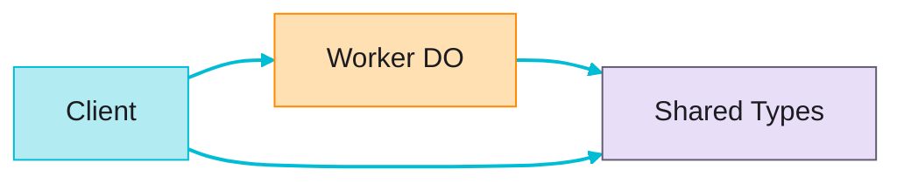

# Vaders

Multiplayer TUI Space Invaders clone (1-4 players) built with OpenTUI and Cloudflare Durable Objects.

<!--
The cover uses the project's actual description from the README as the subtitle, not the through-line. Vaders is a terminal-native game running in a 120x36 character grid with braille pixel art sprites, real-time WebSocket multiplayer, and audio via system players.

Sources:
- https://github.com/adewale/vaders/blob/main/README.md — project description, first paragraph
-->

---
transition: slide-up
---

# What Vaders is and why it exists

Multiplayer TUI Space Invaders clone (1-4 players) built with OpenTUI and Cloudflare Durable Objects.

<v-clicks>

- **Solo mode** — 3 lives, 11x5 alien grid, classic march pattern
- **Co-op** (2-4 players) — 5 shared lives, scaled grids up to 15x6, aliens 1.75x faster
- **30Hz real-time sync** via Cloudflare Durable Objects and WebSocket
- **Braille pixel art** — 2-line sprites, box-drawing characters, color cycling

</v-clicks>

<div v-click class="mt-4 text-lg" style="color: var(--deck-accent); font-weight: 600;">
The core philosophy: accept the constraint.
</div>

<!--
This slide explains what Vaders IS before diving into architecture. The README description appears verbatim. The through-line is introduced here: the project succeeds by embracing terminal limitations rather than fighting them. Chunky movement is not a bug — it is the correct feel for the genre. Solid foreground colors are not a limitation — they enable Amiga-style color cycling animation.

Sources:
- https://github.com/adewale/vaders/blob/main/README.md — game modes, requirements, feature list
- https://github.com/adewale/vaders/blob/main/CLAUDE.md — scaling table: 1 player = 3 lives, 2-4 = 5 shared lives
- https://github.com/adewale/vaders/blob/main/Lessons_learned.md — braille pixel art sprites, color cycling technique
-->

---
transition: morph-fade
layout: two-cols-header
---

# Architecture

Three workspaces, one authoritative server

::left::

<v-clicks>

- **Client** — Bun + OpenTUI React terminal app
- **Worker** — Cloudflare Durable Object game server
- **Shared** — TypeScript types and protocol definitions

</v-clicks>

::right::



The Durable Object runs the 30Hz game loop and broadcasts full state via WebSocket. The client renders and sends input. Shared types enforce the contract.

<!--
The architecture is a classic authoritative-server split. The Durable Object uses hibernatable WebSockets — it can sleep while maintaining connections, waking on messages or alarms. Alarms replace setInterval for hibernation compatibility. The game loop ticks at 33ms intervals. All game logic flows through a single pure reducer function, making state changes deterministic and testable.

Sources:
- https://github.com/adewale/vaders/blob/main/README.md — architecture section showing three workspaces
- https://github.com/adewale/vaders/blob/main/CLAUDE.md — tick rate 33ms, full state sync, hibernatable WebSockets
- https://github.com/adewale/vaders/blob/main/Lessons_learned.md — pure reducer pattern, alarm-based tick loop
-->

---
layout: section
transition: iris
---

# Terminal constraints become retro aesthetic

Chunky movement. Solid colors. Character cells. Not bugs — design decisions.

<!--
Through-line echo: the Lessons Learned document repeatedly returns to this theme. Aliens moving 2 cells every 18 ticks "looks correct for the genre." Color cycling through a palette (the Amiga technique) creates compelling animation from minimal state changes. The 120x36 grid forced 2-line sprites that are more readable than single-line alternatives. Every constraint shaped a better design.

Sources:
- https://github.com/adewale/vaders/blob/main/Lessons_learned.md — TUI constraints section, color cycling, sprite design
-->

---
transition: slide-up
---

# Full sync at 30Hz — simplicity wins

The server broadcasts complete game state every tick.

<v-clicks>

- Game state is ~2KB per tick
- With 4 players: 120 messages/second — within WebSocket limits
- Delta updates were considered and rejected
- Only optimization: omit `config` and `playerId` after initial join

</v-clicks>

```ts
// Full sync — simple and correct
this.broadcast({ type: 'sync', state: this.game })
```

<!--
Accept the constraint: full sync sounds wasteful, but at this scale the simplicity is worth it. The Lessons Learned document is explicit: "Start with full state sync. Only optimize if bandwidth becomes a problem." Binary protocols and compression were also rejected — JSON at 2KB is below the compression benefit threshold. The one optimization applied (omitting config after join) roughly halved payload size without adding complexity.

Sources:
- https://github.com/adewale/vaders/blob/main/Lessons_learned.md — full sync vs delta updates, broadcast optimization
- https://github.com/adewale/vaders/blob/main/CLAUDE.md — WebSocket protocol: sync messages at 30Hz
-->

---
layout: fact
transition: fade
---

# 620+
tests across all workspaces

Including property-based tests with `fast-check` that caught a color conversion bug no hand-written test found — gray values 239-248 produced index 256, one past the valid range.

<!--
The hexTo256Color function maps 24-bit hex colors to the 256-color terminal palette. It had been working in production and passing all example-based tests. Property-based testing with fast-check immediately found a counterexample: Math.round((243 - 8) / 10) + 232 = 256, which is out of the valid [16, 255] range. The fix was lowering the white detection threshold from > 248 to > 238. This is a concrete example of the through-line: property-based testing accepted that human test authors cannot enumerate every edge case, and let the machine find the gap.

Sources:
- https://github.com/adewale/vaders/blob/main/CHANGELOG.md — "620+ tests" in v1.0.0 feature list
- https://github.com/adewale/vaders/blob/main/Lessons_learned.md — property-based testing section, hexTo256Color counterexample
-->

---
layout: end
transition: fade
---

# Accept the constraint

Chunky movement, solid colors, full state sync. The terminal shaped a better game.

<!--
Resolution of the through-line. Every limitation produced a design strength: chunky movement at 2 cells per 18 ticks matches the Space Invaders genre feel. Solid foreground colors enable Amiga-style color cycling. Full state sync keeps the codebase simple at the cost of bandwidth that does not matter at this scale. Property-based testing accepts that humans cannot enumerate every edge case. The constraints were not obstacles to work around — they were the design.

Sources:
- https://github.com/adewale/vaders/blob/main/Lessons_learned.md — summary principles: "Accept terminal constraints. Chunky movement and solid colors are features, not bugs."
-->
