# The workflow: PDF in, Croissant out

```mermaid {scale: 0.72}
graph LR
  A["Upload PDF"]
  B["AI Agent reads paper"]
  C["Extract metadata"]
  D["Build JSON-LD"]
  E["Validate"]
  F["Download Croissant"]
  A --> B
  B --> C
  C --> D
  D --> E
  E --> F
  style A fill:#fffff8,stroke:#2d5f8a,color:#1a1a1a
  style B fill:#2d5f8a,stroke:#2d5f8a,color:#fffff8
  style C fill:#2d5f8a,stroke:#2d5f8a,color:#fffff8
  style D fill:#fffff8,stroke:#2d5f8a,color:#1a1a1a
  style E fill:#fffff8,stroke:#2d5f8a,color:#1a1a1a
  style F fill:#2d5f8a,stroke:#2d5f8a,color:#fffff8
  linkStyle default stroke:#2d5f8a,stroke-width:2px
```

Upload a PDF of any academic paper that introduces an ML dataset. The agent reads it, extracts metadata, builds valid Croissant JSON-LD, and validates the output.
