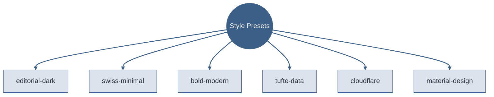

# Six Presets, Six Personalities

Each preset controls typography, color, motion, and layout tendencies — the same content looks and feels different under each preset.

<!-- Graph TD (top-down) for hierarchies. Circle node for the hub, rectangles for leaves. Every node explicitly styled — Beautiful Mermaid auto-theming is unreliable.

Sources:
- file:slide-maker/STYLE_PRESETS.md — six preset definitions -->
