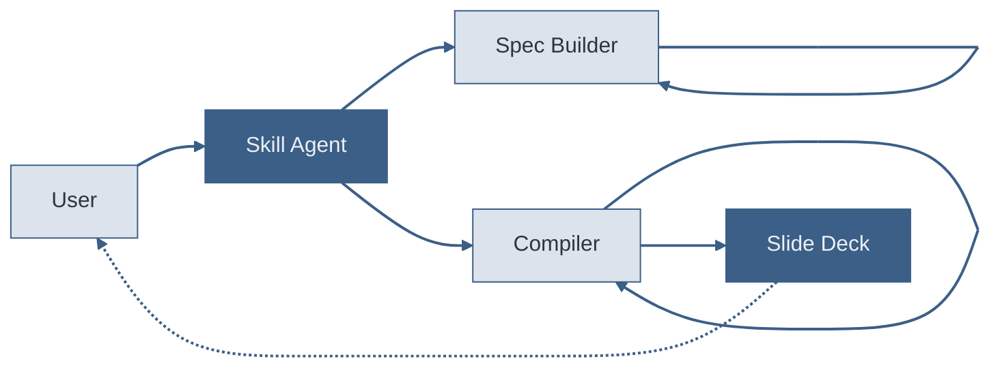

# The Compilation Pipeline

Five actors, two self-loops. The Spec Builder re-enters itself for source-grounding. The Compiler loops for layout resolution. The dashed return is the live preview.

<!-- sequenceDiagram and stateDiagram-v2 produce black boxes with Beautiful Mermaid. Always use flowcharts with inline styles instead. Self-loop arrows show recursive processes.

Sources:
- file:slide-maker/COMPILER_RULES.md — Mermaid guidelines: inline styles always required
- file:slide-maker/COMPILER_RULES.md — diagram insight annotations required -->
