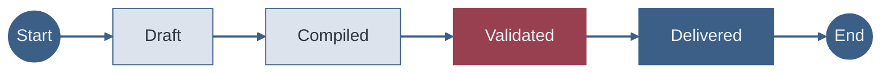

# Slides Have a Lifecycle Most Presenters Ignore

The backward edges matter most but can't be shown cleanly in Mermaid (cycles break the layout). Validation failures return to **Draft**, not to Compiled — structural fixes require a full recompile. Post-talk revisions also restart from Draft.

<!-- stateDiagram-v2 produces black boxes — use flowcharts with circle nodes for start/end instead. Backward transitions highlight recovery paths that audiences overlook.

Sources:
- file:slide-maker/COMPILER_RULES.md — Mermaid guidelines: inline styles always required
- file:slide-maker/COMPILER_RULES.md — diagram insight annotations required -->
