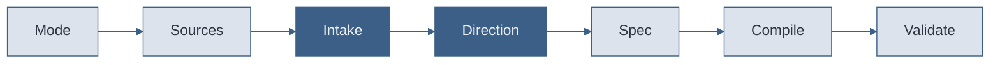

# Seven-Step Workflow

<v-clicks>

- **Mode** — new deck or update to existing
- **Sources** — gather README, ARCHITECTURE, CHANGELOG, LESSONS_LEARNED
- **Intake** — normalize title, goal, audience, tone, target length
- **Direction** — offer 2-3 visual directions in words only
- **Spec** — write `deck.spec.md` before any slides
- **Compile** — generate slides, styles, layouts, components
- **Validate** — spec matches slides, density controlled, abstractions justified

</v-clicks>

<!-- The Skill's workflow enforces direction-before-content. Visual identity is decided at step 4, before a single slide is written at step 6.

[click] Mode — new deck or update to existing. This determines which workflow branches apply.

[click] Sources — gather README, ARCHITECTURE, CHANGELOG, LESSONS_LEARNED. The raw material the deck is built from.

[click] Intake — normalize title, goal, audience, tone, target length. Establish what the deck needs to accomplish.

[click] Direction — offer 2-3 visual directions in words only. No slides yet. This is the anti-generic mechanism.

[click] Spec — write deck.spec.md before any slides. The blueprint that prevents both generic and brittle output.

[click] Compile — generate slides, styles, layouts, components. This is where the actual presentation is built.

[click] Validate — spec matches slides, density controlled, abstractions justified. The final quality gate.

Sources:
- file:slide-maker/SKILL.md — workflow steps 1-7
- file:slide-maker/COMPILER_RULES.md — compilation phases -->
