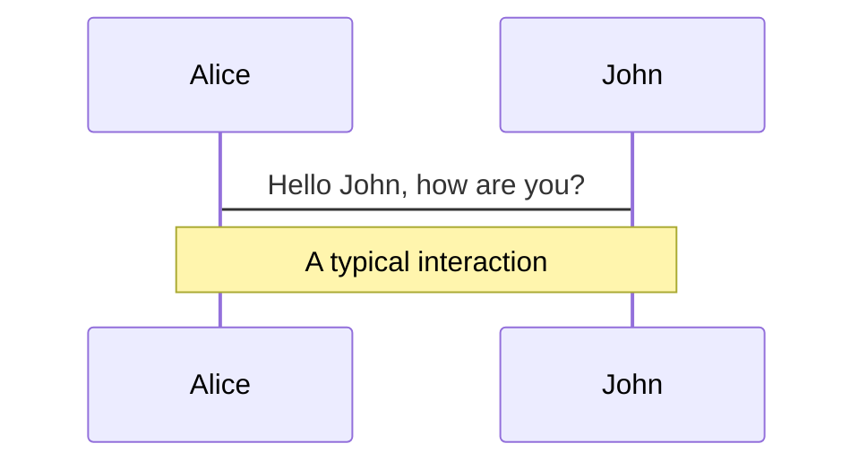
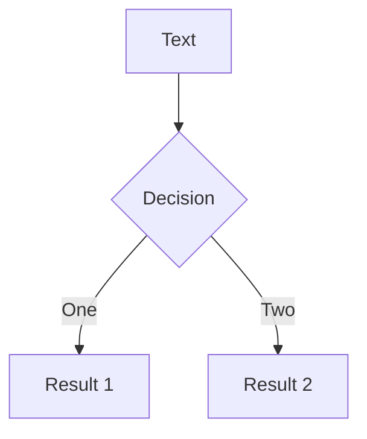
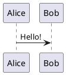

# Slidev Comprehensive Reference

Complete reference for building high-quality Slidev slide decks. Covers every feature, layout, component, directive, and configuration option available in Slidev v52.13+.

---

## Table of Contents

1. [Slide Syntax Fundamentals](#1-slide-syntax-fundamentals)
2. [Headmatter (Global Configuration)](#2-headmatter-global-configuration)
3. [Per-Slide Frontmatter](#3-per-slide-frontmatter)
4. [Built-in Layouts](#4-built-in-layouts)
5. [Slot Sugar Syntax](#5-slot-sugar-syntax)
6. [Built-in Components](#6-built-in-components)
7. [Animations & Clicks](#7-animations--clicks)
8. [Slide Transitions](#8-slide-transitions)
9. [Motion (v-motion)](#9-motion-v-motion)
10. [Rough Marker Annotations](#10-rough-marker-annotations)
11. [Code Blocks & Highlighting](#11-code-blocks--highlighting)
12. [Shiki Magic Move](#12-shiki-magic-move)
13. [Import Code Snippets](#13-import-code-snippets)
14. [Mermaid Diagrams](#14-mermaid-diagrams)
15. [PlantUML Diagrams](#15-plantuml-diagrams)
16. [LaTeX / Math](#16-latex--math)
17. [Icons](#17-icons)
18. [MDC Syntax](#18-mdc-syntax)
19. [Scoped Styles](#19-scoped-styles)
20. [Drawing & Annotations](#20-drawing--annotations)
21. [Draggable Elements](#21-draggable-elements)
22. [Importing Slides](#22-importing-slides)
23. [Frontmatter Merging](#23-frontmatter-merging)
24. [Presenter Notes](#24-presenter-notes)
25. [Global Layers](#25-global-layers)
26. [Global Context & Composables](#26-global-context--composables)
27. [Slide Hooks](#27-slide-hooks)
28. [Fonts](#28-fonts)
29. [UnoCSS](#29-unocss)
30. [Canvas Size & Zoom](#30-canvas-size--zoom)
31. [Exporting](#31-exporting)
32. [SEO & Open Graph](#32-seo--open-graph)
33. [Navigation & Keyboard Shortcuts](#33-navigation--keyboard-shortcuts)
34. [Presenter Mode](#34-presenter-mode)
35. [Recording](#35-recording)
36. [Directory Structure](#36-directory-structure)
37. [Configuration Files](#37-configuration-files)
38. [CLI Commands](#38-cli-commands)
39. [Theme Writing](#39-theme-writing)
40. [Addon Writing](#40-addon-writing)
41. [FAQ & Troubleshooting](#41-faq--troubleshooting)

---

## 1. Slide Syntax Fundamentals

### Slide Separators

Slides are separated by `---` with blank lines on both sides:

```md
# Slide 1

Content here

---

# Slide 2

More content
```

### First Slide = Headmatter

The first YAML block configures the entire presentation (headmatter). Subsequent YAML blocks configure individual slides (frontmatter).

```md
---
theme: seriph
title: My Presentation
---

# First slide content

---
layout: center
background: /background-1.png
class: text-white
---

# Second slide content
```

---

## 2. Headmatter (Global Configuration)

Place in the first `---` block. Controls the entire deck.

### Theme & Addons

| Key | Type | Default | Description |
|-----|------|---------|-------------|
| `theme` | string | `'default'` | Theme ID, npm package, or local path |
| `addons` | string[] | `[]` | Addon package names or local paths |

### Document Metadata

| Key | Type | Default | Description |
|-----|------|---------|-------------|
| `title` | string | — | Slide deck title |
| `titleTemplate` | string | `'%s - Slidev'` | Webpage title format (`%s` = slide title) |
| `info` | string/false | `false` | Markdown string with deck information |
| `author` | string | — | Author for PDF/PPTX metadata |
| `keywords` | string | — | Comma-delimited keywords for PDF export |

### Presentation Features

| Key | Type | Default | Description |
|-----|------|---------|-------------|
| `presenter` | boolean/`'dev'`/`'build'` | `true` | Enable presenter mode |
| `browserExporter` | boolean/`'dev'`/`'build'` | `'dev'` | Enable in-browser export |
| `download` | boolean/string | `false` | Enable PDF download (true or custom URL) |
| `exportFilename` | string | `'slidev-exported'` | Default export filename |
| `record` | boolean/`'dev'`/`'build'` | `'dev'` | Enable recording |
| `contextMenu` | boolean/`'dev'`/`'build'` | `true` | Enable right-click context menu |

### Code & Technical

| Key | Type | Default | Description |
|-----|------|---------|-------------|
| `lineNumbers` | boolean | `false` | Show line numbers in code blocks globally |
| `remoteAssets` | boolean/`'dev'`/`'build'` | `false` | Download and cache remote assets locally |
| `mdc` | boolean | `false` | Enable MDC (Markdown Components) syntax |
| `codeCopy` | boolean | `true` | Show copy button on code blocks |

### Display & UI

| Key | Type | Default | Description |
|-----|------|---------|-------------|
| `colorSchema` | `'auto'`/`'light'`/`'dark'` | `'auto'` | Force color scheme |
| `routerMode` | `'history'`/`'hash'` | `'history'` | Vue Router mode |
| `aspectRatio` | number | `16/9` | Slide aspect ratio |
| `canvasWidth` | number | `980` | Canvas width in pixels |
| `selectable` | boolean | `true` | Enable text selection |
| `wakeLock` | boolean/`'dev'`/`'build'` | `true` | Prevent screen sleep |
| `overviewSnapshots` | boolean | `false` | Take per-slide snapshots for overview |

### Theme Configuration

```yaml
---
themeConfig:
  primary: '#5d8392'
  # Any custom CSS variables the theme supports
---
```

### Fonts

```yaml
---
fonts:
  sans: Robot
  serif: Robot Slab
  mono: Fira Code
  weights: '200,400,600'
  italic: false
  fallbacks: true
  provider: google   # 'google' | 'coollabs' | 'none'
  local: Helvetica Neue  # Skip CDN import for this font
---
```

### Drawing

```yaml
---
drawings:
  enabled: true       # or false, or 'dev'
  persist: true        # Save as SVG in .slidev/drawings
  presenterOnly: false # Restrict to presenter mode
  syncAll: true        # Sync across all instances
---
```

### HTML & SEO

```yaml
---
htmlAttrs:
  dir: ltr
  lang: en
seoMeta:
  ogTitle: My Presentation
  ogDescription: A great talk
  ogImage: https://cover.sli.dev
  ogUrl: https://example.com
  twitterCard: summary_large_image
  twitterTitle: My Presentation
  twitterDescription: A great talk
  twitterImage: https://cover.sli.dev
  twitterSite: username
  twitterUrl: https://example.com
---
```

### Defaults (Apply to All Slides)

```yaml
---
defaults:
  layout: default
  transition: slide-left
---
```

### Export Options

```yaml
---
export:
  format: pdf
  timeout: 30000
  dark: false
  withClicks: false
  withToc: false
---
```

### PlantUML Server

```yaml
---
plantUmlServer: https://www.plantuml.com/plantuml
---
```

### Magic Move

```yaml
---
magicMoveDuration: 800        # milliseconds (default)
magicMoveCopy: true           # true | false | 'always' | 'final'
---
```

---

## 3. Per-Slide Frontmatter

Place at the top of each slide (after `---` separator).

| Key | Type | Default | Description |
|-----|------|---------|-------------|
| `layout` | string | `'cover'` (first) / `'default'` (rest) | Layout component name |
| `transition` | string/object | undefined | Slide transition |
| `clicks` | number | 0 | Custom total click count |
| `clicksStart` | number | 0 | Starting click count |
| `level` | number | 1 (if title declared) | Title level for ToC |
| `title` | string | — | Override title for ToC/TitleRenderer |
| `hideInToc` | boolean | `false` | Hide from ToC components |
| `disabled` / `hide` | boolean | `false` | Completely disable/hide slide |
| `preload` | boolean | `true` | Mount slide before entering |
| `routeAlias` | string | undefined | URL route alias |
| `zoom` | number | 1 | Custom zoom scale for this slide |
| `src` | string | undefined | Import from external markdown file |
| `class` | string | — | Additional CSS classes |
| `background` | string | — | Background image URL or color |
| `dragPos` | object | `{}` | Positions of draggable elements |

### Example

```md
---
layout: two-cols
transition: slide-left
class: text-sm
clicks: 5
---
```

---

## 4. Built-in Layouts

### `default`
Basic layout for general content. No special props.

```md
---
layout: default
---

# Title
Content here
```

### `center`
Content centered on screen.

```md
---
layout: center
---

# Centered Title
```

### `cover`
Cover/title page. Default layout for the first slide.

```md
---
layout: cover
---

# Presentation Title
Subtitle text
```

### `end`
Final slide of the presentation.

```md
---
layout: end
---

# Thank You
```

### `intro`
Introduction slide.

```md
---
layout: intro
---

# Speaker Intro
```

### `section`
Section divider/marker.

```md
---
layout: section
---

# Part 2: Advanced Topics
```

### `statement`
Prominent statement or affirmation.

```md
---
layout: statement
---

# We believe in open source
```

### `fact`
Prominent fact or data point.

```md
---
layout: fact
---

# 100%
Test Coverage
```

### `quote`
Prominent quotation display.

```md
---
layout: quote
---

# "The best way to predict the future is to invent it."
— Alan Kay
```

### `full`
Full-screen content usage (no padding).

```md
---
layout: full
---

# Full Width Content
```

### `none`
Unstyled layout. No default styling applied.

```md
---
layout: none
---

Raw content
```

### `image`
Full-screen image as background.

| Prop | Type | Description |
|------|------|-------------|
| `image` | string | Image URL |
| `backgroundSize` | string | CSS background-size (default: `cover`) |

```md
---
layout: image
image: /photo.jpg
backgroundSize: contain
---
```

### `image-left`
Image on the left, content on the right.

| Prop | Type | Description |
|------|------|-------------|
| `image` | string | Image URL |
| `class` | string | Custom CSS class for content area |
| `backgroundSize` | string | CSS background-size |

```md
---
layout: image-left
image: /diagram.png
backgroundSize: contain
class: my-cool-content
---

# Description
Text on the right side
```

### `image-right`
Image on the right, content on the left.

| Prop | Type | Description |
|------|------|-------------|
| `image` | string | Image URL |
| `class` | string | Custom CSS class for content area |
| `backgroundSize` | string | CSS background-size |

```md
---
layout: image-right
image: /screenshot.png
---

# Description
Text on the left side
```

### `iframe`
Full-screen embedded webpage.

| Prop | Type | Description |
|------|------|-------------|
| `url` | string | URL to embed |

```md
---
layout: iframe
url: https://github.com/slidevjs/slidev
---
```

### `iframe-left`
Webpage on the left, content on the right.

| Prop | Type | Description |
|------|------|-------------|
| `url` | string | URL to embed |
| `class` | string | Custom CSS class |

```md
---
layout: iframe-left
url: https://github.com/slidevjs/slidev
---

# Description
```

### `iframe-right`
Webpage on the right, content on the left.

| Prop | Type | Description |
|------|------|-------------|
| `url` | string | URL to embed |
| `class` | string | Custom CSS class |

```md
---
layout: iframe-right
url: https://github.com/slidevjs/slidev
---

# Description
```

### `two-cols`
Two-column layout with `default` (left) and `right` slots.

```md
---
layout: two-cols
---

# Left Column

Content on the left

::right::

# Right Column

Content on the right
```

### `two-cols-header`
Header spanning both columns, then a left and right column.

```md
---
layout: two-cols-header
---

# Header Title

::left::

Left content

::right::

Right content
```

---

## 5. Slot Sugar Syntax

Shorthand for Vue named slots using `::name::` markers. Equivalent to `<template v-slot:name>`.

### Basic Usage

```md
---
layout: two-cols
---

# Left side content

::right::

# Right side content
```

### Explicit Default Slot

```md
---
layout: two-cols
---

::right::

# Right (shown first in source)

::default::

# Left (explicit default)
```

### Full Vue Syntax (also valid)

```md
---
layout: two-cols
---

<template v-slot:default>

# Left

</template>
<template v-slot:right>

# Right

</template>
```

---

## 6. Built-in Components

### Arrow

Draws an arrow line between two points.

| Prop | Type | Default | Description |
|------|------|---------|-------------|
| `x1` | number | required | Start X coordinate |
| `y1` | number | required | Start Y coordinate |
| `x2` | number | required | End X coordinate |
| `y2` | number | required | End Y coordinate |
| `width` | number | `2` | Line width |
| `color` | string | `'currentColor'` | Arrow color |
| `two-way` | boolean | `false` | Bidirectional arrow |

```md
<Arrow x1="10" y1="20" x2="100" y2="200" />
<Arrow x1="10" y1="10" x2="200" y2="200" two-way />
```

### VDragArrow

Draggable arrow with same props as Arrow. See [Draggable Elements](#24-draggable-elements).

### AutoFitText

Auto-sizes text to fit within boundaries.

| Prop | Type | Default | Description |
|------|------|---------|-------------|
| `max` | number | `100` | Maximum font size |
| `min` | number | `30` | Minimum font size |
| `modelValue` | string | `''` | Text content |

```md
<AutoFitText :max="200" :min="100" modelValue="Big Text"/>
```

### LightOrDark

Renders different content based on light/dark mode.

```md
<LightOrDark>
  <template #dark>Dark mode content</template>
  <template #light>Light mode content</template>
</LightOrDark>
```

### Link

Navigation link between slides.

| Prop | Type | Description |
|------|------|-------------|
| `to` | number/string | Slide number or route alias |
| `title` | string | Display text |

```md
<Link to="42">Go to slide 42</Link>
<Link to="solutions" title="Go to solutions"/>
```

### RenderWhen

Conditional rendering based on context.

| Prop | Type | Description |
|------|------|-------------|
| `context` | string | `'main'`/`'visible'`/`'print'`/`'slide'`/`'overview'`/`'presenter'`/`'previewNext'` |

Slots: `#default` (when matched), `#fallback` (when not matched).

```md
<RenderWhen context="presenter">
  Only visible in presenter mode
</RenderWhen>
```

### SlideCurrentNo

Displays the current slide number.

```md
<SlideCurrentNo />
```

### SlidesTotal

Displays total slide count.

```md
<SlidesTotal />
```

### TitleRenderer

Renders the title of any slide as parsed HTML.

| Prop | Type | Description |
|------|------|-------------|
| `no` | number | Slide number to extract title from |

```md
<TitleRenderer no="42" />
```

Import: `import TitleRenderer from '#slidev/title-renderer'`

### Toc (Table of Contents)

| Prop | Type | Default | Description |
|------|------|---------|-------------|
| `columns` | number | `1` | Number of columns |
| `listClass` | string | `''` | CSS class for list |
| `maxDepth` | number | `Infinity` | Maximum heading depth |
| `minDepth` | number | `1` | Minimum heading depth |
| `mode` | string | `'all'` | `'all'`/`'onlyCurrentTree'`/`'onlySiblings'` |

```md
<Toc columns="2" minDepth="1" maxDepth="2" mode="all" />
```

Hide a slide from ToC via frontmatter: `hideInToc: true`

### Transform

Apply CSS transformations to elements.

| Prop | Type | Default | Description |
|------|------|---------|-------------|
| `scale` | number | `1` | Scale factor |
| `origin` | string | `'top left'` | Transform origin |

```md
<Transform :scale="0.5" origin="top center">
  <YourElements />
</Transform>
```

### Tweet

Embed a Twitter/X post.

| Prop | Type | Default | Description |
|------|------|---------|-------------|
| `id` | string | required | Tweet ID |
| `scale` | number | `1` | Scale factor |
| `conversation` | string | `'none'` | Show conversation thread |
| `cards` | string | `'visible'` | `'hidden'`/`'visible'` |

```md
<Tweet id="1423506925590208512" />
```

### Youtube

Embed a YouTube video.

| Prop | Type | Description |
|------|------|-------------|
| `id` | string | Video ID (required) |
| `width` | number | Video width |
| `height` | number | Video height |

```md
<Youtube id="luoMHjh-XcQ" />
<Youtube id="luoMHjh-XcQ?start=1234" />
```

### SlidevVideo

Video with extended controls.

| Prop | Type | Default | Description |
|------|------|---------|-------------|
| `controls` | boolean | `false` | Show controls |
| `autoplay` | boolean/`'once'` | `false` | Auto-play behavior |
| `autoreset` | `'slide'`/`'click'`/undefined | — | Reset behavior |
| `poster` | string | — | Poster image |
| `printPoster` | string | — | Poster for print |
| `timestamp` | number | `0` | Start position (seconds) |
| `printTimestamp` | number | — | Timestamp for printing |

```md
<SlidevVideo v-click autoplay controls>
  <source src="/video.mp4" type="video/mp4" />
  <source src="/video.webm" type="video/webm" />
</SlidevVideo>
```

### PoweredBySlidev

Attribution footer linking to Slidev site.

```md
<PoweredBySlidev />
```

### VSwitch

Toggles between slot content on clicks.

| Prop | Type | Default | Description |
|------|------|---------|-------------|
| `unmount` | boolean | `false` | Unmount inactive slots |
| `tag` | string | `'div'` | Wrapper tag |
| `childTag` | string | `'div'` | Child wrapper tag |
| `transition` | boolean/object | `false` | Enable transitions |

```md
<v-switch>
  <template #1>Shown at click 1</template>
  <template #2>Shown at click 2</template>
  <template #5-7>Shown at clicks 5-6</template>
</v-switch>
```

---

## 7. Animations & Clicks

### v-click Directive

Makes elements invisible until a click event.

```md
<!-- As a directive -->
<div v-click>Appears on next click</div>

<!-- As a component -->
<v-click>Appears on next click</v-click>
```

### v-after

Reveals with the previous v-click (same timing).

```md
<div v-click>Shows on click 1</div>
<div v-after>Also shows on click 1</div>
```

### v-click.hide (Hide Modifier)

Hides the element on click instead of showing.

```md
<div v-click.hide>Visible initially, hidden on click</div>
<v-click hide>Also hidden on click</v-click>
```

### v-clicks

Applies v-click to every child element. Great for lists.

```md
<v-clicks>

- Item 1
- Item 2
- Item 3

</v-clicks>
```

| Prop | Type | Description |
|------|------|-------------|
| `depth` | number | Nesting depth (e.g., `depth="2"` for nested lists) |
| `every` | number | Items revealed per click (e.g., `every="2"`) |

### Absolute Click Positioning

Specify exact click number:

```md
<div v-click="3">Shows on exactly click 3</div>
<v-click at="2"><div>Shows on click 2</div></v-click>
```

### Relative Click Positioning

Relative to previous click:

```md
<div v-click>Click 1</div>
<v-click at="+2"><div>Click 3 (1 + 2)</div></v-click>
<div v-click.hide="'-1'">Hidden at click 2</div>
```

### Enter/Leave Arrays

Show and hide with arrays `[enter, leave]`:

```md
<div v-click="[2, 4]">Visible at clicks 2-3, hidden at 4</div>
<div v-click="['+1', '+1']">Visible for exactly one click step</div>
```

### Custom Total Clicks

Override automatic click counting:

```yaml
---
clicks: 10
---
```

### Transition Classes for Click Animations

```css
/* In <style> block or global styles */
.slidev-vclick-target {
  transition: all 500ms ease;
}
.slidev-vclick-hidden {
  transform: scale(0);
  opacity: 0;
}
```

---

## 8. Slide Transitions

### Global Transition (Headmatter)

```yaml
---
transition: slide-left
---
```

### Per-Slide Transition

```yaml
---
transition: fade
---
```

### Built-in Transitions

| Name | Description |
|------|-------------|
| `fade` | Crossfade |
| `fade-out` | Fade out then in |
| `slide-left` | Slide from right to left |
| `slide-right` | Slide from left to right |
| `slide-up` | Slide from bottom to top |
| `slide-down` | Slide from top to bottom |
| `view-transition` | Uses the View Transitions API |

### Directional Transitions

Different transitions for forward vs backward navigation:

```yaml
---
transition: slide-left | slide-right
---
```

### Custom Transitions

```yaml
---
transition: my-transition
---
```

Then define in CSS:

```css
.my-transition-enter-active,
.my-transition-leave-active {
  transition: opacity 0.5s ease;
}
.my-transition-enter-from,
.my-transition-leave-to {
  opacity: 0;
}
```

### Advanced Transition Object

```yaml
---
transition:
  name: my-transition
  enterFromClass: custom-enter-from
  enterActiveClass: custom-enter-active
---
```

---

## 9. Motion (v-motion)

Powered by `@vueuse/motion`. Animate element properties with physics-based animations.

### Basic Motion

```md
<div
  v-motion
  :initial="{ x: -80 }"
  :enter="{ x: 0 }"
  :leave="{ x: 80 }"
>
  Animated text
</div>
```

### Click-Triggered Motion

```md
<div
  v-motion
  :initial="{ x: -80 }"
  :enter="{ x: 0, y: 0 }"
  :click-1="{ x: 0, y: 30 }"
  :click-2="{ y: 60 }"
  :click-2-4="{ x: 40 }"
  :leave="{ y: 0, x: 80 }"
>
  Multi-step animation
</div>
```

### Motion Variants

| Variant | When It Triggers |
|---------|-----------------|
| `initial` | Before slide enters or when v-click hides element |
| `enter` | When slide loads and element becomes visible |
| `click-x` | At absolute click number x |
| `click-x-y` | When x <= clicks < y |
| `leave` | After slide leaves or when v-click hides element |

---

## 10. Rough Marker Annotations

Hand-drawn style annotations powered by Rough Notation.

### v-mark Directive

```md
<span v-mark.underline>underlined text</span>
<span v-mark.circle>circled text</span>
<span v-mark.red>red annotation</span>
```

### Available Modifiers

- Type modifiers: `.underline`, `.circle`, `.highlight`, `.strike-through`, `.crossed-off`, `.bracket`, `.box`
- Color modifiers: `.red`, `.blue`, `.green`, etc. (any UnoCSS color)

### Click Behavior

Works like v-click -- triggers on next click by default:

```md
<span v-mark="5">Appears on click 5</span>
<span v-mark="'+1'">Appears on next relative click</span>
```

### Object Syntax

```md
<span v-mark="{ at: 5, color: '#234', type: 'circle' }">
  Custom annotation
</span>
```

---

## 11. Code Blocks & Highlighting

### Basic Code Block

````md
```ts
console.log('Hello, World!')
```
````

### Line Highlighting (Static)

````md
```ts {2,3}
function add(
  a: Ref<number> | number,    // highlighted
  b: Ref<number> | number     // highlighted
) {
  return computed(() => unref(a) + unref(b))
}
```
````

### Line Highlighting (Click-Based / Dynamic)

Separate highlight groups with `|`:

````md
```ts {2-3|5|all}
function add(
  a: Ref<number> | number,
  b: Ref<number> | number
) {
  return computed(() => unref(a) + unref(b))
}
```
````

Progression: lines 2-3 -> line 5 -> all lines.

### Special Keywords

- `{hide}` -- Completely hides the code block initially
- `{none}` -- Shows code without highlighting any lines
- `{all}` -- Highlights all lines
- `{hide|none}` -- Hidden, then fully visible without highlighting
- `{*}` -- Placeholder for line highlighting (used with other options)

### Line Numbers

Global: set `lineNumbers: true` in headmatter.

Per-block:

````md
```ts {2,3}{lines:true}
// code with line numbers
```
````

Custom starting line:

````md
```ts {6,7}{lines:true,startLine:5}
// line numbers start at 5
```
````

### Max Height (Scrollable Code Blocks)

````md
```ts {2|3|7|12}{maxHeight:'100px'}
// long code that scrolls
```
````

With placeholder:

````md
```ts {*}{maxHeight:'200px'}
// shows all code, scrollable
```
````

---

## 12. Shiki Magic Move

Animated transitions between code states. Uses 4 backticks.

### Basic Syntax

`````md
````md magic-move
```js
console.log(`Step ${1}`)
```
```js
console.log(`Step ${1 + 1}`)
```
```ts
console.log(`Step ${3}` as string)
```
````
`````

### With Line Highlighting and Options

`````md
````md magic-move {at:4, lines: true}
```js {*|1|2-5}
// step 1
```
```js {*}{lines: false}
// step 2
```
````
`````

### With Title Bar (v0.52+)

`````md
````md magic-move
```js [app.js]
console.log('Step 1')
```
```js [app.js]
console.log('Step 2')
```
````
`````

### Configuration

| Option | Scope | Default | Description |
|--------|-------|---------|-------------|
| `magicMoveDuration` | headmatter | `800` | Animation duration (ms) |
| `duration` | per-block | `800` | Override animation duration |
| `magicMoveCopy` | headmatter | `true` | Show copy button: `true`/`false`/`'always'`/`'final'` |

**Gotcha**: Shiki Magic Move does NOT support transformers.

---

## 13. Import Code Snippets

### Basic Import

```md
<<< @/snippets/snippet.js
```

`@` references the project root. Recommended directory: `@/snippets/`.

### Regional Import (VS Code Regions)

```md
<<< @/snippets/snippet.js#region-name
```

### Language Override

```md
<<< @/snippets/snippet.js ts
```

### With Options

```md
<<< @/snippets/snippet.js {2,3|5}{lines:true}
<<< @/snippets/snippet.js ts {monaco}{height:200px}
<<< @/snippets/snippet.js {*}{lines:true}
```

---

## 14. Mermaid Diagrams

### Basic Syntax

````md

````

### With Options

````md

````

### Advanced Configuration

Create `./setup/mermaid.ts`:

```ts
import { defineMermaidSetup } from '@slidev/types'

export default defineMermaidSetup(() => {
  return {
    theme: 'forest',
  }
})
```

### Custom Theme Variables

```ts
export default defineMermaidSetup(() => {
  return {
    theme: 'base',
    themeVariables: {
      noteBkgColor: '#181d29',
      noteTextColor: '#F3EFF5cc',
      noteBorderColor: '#404551',
      actorBkg: '#0E131F',
      actorBorder: '#44FFD2',
      actorTextColor: '#F3EFF5',
      actorLineColor: '#F3EFF5',
      signalColor: '#F3EFF5',
      signalTextColor: '#F3EFF5',
    }
  }
})
```

---

## 15. PlantUML Diagrams

````md

````

Default server: `https://www.plantuml.com/plantuml`. Override in headmatter:

```yaml
---
plantUmlServer: https://your-plantuml-server.com/plantuml
---
```

---

## 16. LaTeX / Math

Powered by KaTeX.

### Inline Math

```md
The formula $\sqrt{3x-1}+(1+x)^2$ is inline.
```

### Block Math

```md
$$
\begin{aligned}
\nabla \cdot \vec{E} &= \frac{\rho}{\varepsilon_0} \\
\nabla \cdot \vec{B} &= 0
\end{aligned}
$$
```

### Line Highlighting in Math Blocks

```md
$$ {1|3|all}
\begin{aligned}
\text{Line 1} \\
\text{Line 2} \\
\text{Line 3}
\end{aligned}
$$
```

Supports `at` and `finally` options like code blocks.

### Chemical Equations (mhchem)

Enable by creating `vite.config.ts`:

```ts
import 'katex/contrib/mhchem'
export default {}
```

Then use:

```md
$$
\displaystyle{\ce{B(OH)3 + H2O <--> B(OH)4^- + H+}}
$$
```

### KaTeX Configuration

Create `./setup/katex.ts`:

```ts
import { defineKatexSetup } from '@slidev/types'

export default defineKatexSetup(() => {
  return {
    maxExpand: 2000,
  }
})
```

---

## 17. Icons

Uses Iconify via `unplugin-icons`. Pattern: `{collection-name}-{icon-name}`.

### Install Collection

```bash
npm install @iconify-json/mdi
npm install @iconify-json/carbon
npm install @iconify-json/tabler
```

### Usage

```md
<mdi-account-circle />
<carbon-badge />
<uim-rocket />
<twemoji-cat-with-tears-of-joy />
<logos-vue />
```

### Styling

```md
<uim-rocket class="text-3xl text-red-400 mx-2" />
<uim-rocket class="text-3xl text-orange-400 animate-ping" />
```

Browse collections at [Icones](https://icones.js.org/).

---

## 18. MDC Syntax

Enable with `mdc: true` in headmatter.

### Inline Components

```md
[red text]{style="color:red"}
:inline-component{prop="value"}
```

### Block Components

```md
::block-component{prop="value"}
The **default** slot content
::
```

### Image Enhancement

```md
{width=500px lazy}
```

---

## 19. Scoped Styles

### Per-Slide CSS

```md
# This is Red

<style>
h1 {
  color: red;
}
</style>
```

Styles are automatically scoped to the current slide.

### Nested CSS (UnoCSS)

```md
<style>
blockquote {
  strong {
    color: teal;
  }
}
</style>
```

### UnoCSS Directives

```md
<style>
blockquote {
  strong {
    --uno: 'text-teal-500 dark:text-teal-400';
  }
}
</style>
```

**Gotcha**: Child combinators (`.a > .b`) are unusable due to Vue scoping mechanism.

### Global Styles

Place in `./style.css` or `./styles/index.css`. These are processed by UnoCSS and PostCSS.

---

## 20. Drawing & Annotations

Built-in drawing powered by the `drauu` library.

### Activation

Click the drawing icon in the navigation bar. Also available in Presenter Mode.

### Configuration

```yaml
---
drawings:
  enabled: true         # true | false | 'dev'
  persist: true          # Save as SVGs in .slidev/drawings
  presenterOnly: true    # Restrict to presenter
  syncAll: true          # Sync across all instances
---
```

### Features

- Real-time sync across instances
- Stylus/pen auto-detection (iPad + Apple Pencil)
- Persisted drawings appear in exported PDFs
- Toolbar with pen, highlighter, eraser, shapes

---

## 21. Draggable Elements

### v-drag Directive

#### Frontmatter-based positioning:

```md
---
dragPos:
  square: 100,100,200,200,0
---


```

Format: `Left,Top,Width,Height,Rotate`

#### Inline positioning:

```md

```

### VDrag Component

```md
---
dragPos:
  foo: 100,100,200,200,0
---

<v-drag pos="foo" text-3xl>
  <div class="i-carbon:arrow-up" />
  Draggable content!
</v-drag>
```

### VDragArrow

```md
<v-drag-arrow />
```

### Controls

- Double-click to activate dragging
- Arrow keys for fine movement
- Shift + drag preserves aspect ratio
- Click outside to deselect
- Height `NaN` (directive) or `_` (component) for auto-height

### Auto-Position

New draggable elements get auto-generated positions; no manual specification needed.

---

## 22. Importing Slides

### Basic Import

```md
---
src: ./pages/toc.md
---
```

Content in the importing slide is ignored.

### Selective Import

```md
---
src: ./another-presentation.md#2,5-7
---
```

Imports slides 2, 5, 6, and 7 from the target file.

### Reuse

The same file can be imported multiple times across different slides.

---

## 23. Frontmatter Merging

When importing slides with `src`, frontmatter from both files merges.

**Main entry (`slides.md`) always wins on conflicts.**

Main entry:
```yaml
---
src: ./cover.md
background: https://sli.dev/bar.png
class: text-center
---
```

External (`cover.md`):
```yaml
---
layout: cover
background: https://sli.dev/foo.png
---

# Cover
Cover Page
```

Result: `layout: cover` from external + `background` and `class` from main entry.

---

## 24. Presenter Notes

Presenter notes are delivery cues visible only in presenter mode — the audience never sees them. Use them for talking points, timing reminders, and click-by-click narration.

### Syntax

Add an HTML comment at the **end** of each slide. Comments placed elsewhere are ignored as notes.

```md
---
layout: cover
---

# Slide Title

Content here

<!-- This is a presenter **note**. Supports Markdown and HTML. -->
```

### Multi-line Notes

```md
<!--
**Key message:** Explain the architecture before diving into code.

- Mention the three-layer design
- Transition: "Let me show you how this works in practice"
- Timing: ~2 minutes on this slide
-->
```

Notes support full Markdown formatting: **bold**, *italic*, `code`, lists, and links.

### Click Markers in Notes

Synchronize notes with click animations so the relevant talking point highlights as you advance:

```md
# Architecture Overview

<v-clicks>

- Frontend (Vue 3 SPA)
- API Gateway (Cloudflare Workers)
- Database (D1 SQLite)

</v-clicks>

<!--
Introduce the three layers at a high level.

[click] Frontend — mention the Vue 3 SPA with Vite bundling.

[click] API Gateway — explain how Workers sit at the edge.

[click] Database — D1 gives us SQLite at the edge, no connection pooling needed.
-->
```

- `[click]` — highlights next section of notes when the next click fires
- `[click:{n}]` — jumps to click n (use for non-sequential reveals)
- Notes auto-scroll to the active section in presenter mode

### Where Notes Appear

| Context | Visible? |
|---------|----------|
| Presenter mode (`/presenter`) | Yes — right panel |
| Slide overview (`/overview`) | Yes — below each slide |
| Notes editor (`/notes-edit`) | Yes — editable live |
| PPTX export | Yes — as speaker notes per slide |
| Audience view | No |
| PDF export | No |

### Best Practices

- Keep notes **delivery-oriented**: what to say, not what the slide says
- Use click markers to pace yourself through progressive reveals
- Include transition phrases: how you'll bridge to the next slide
- Add timing hints for rehearsal: `~90 seconds`, `pause here`
- Notes are slide-local — no separate notes file needed

---

## 25. Global Layers

Special Vue components that persist across all slides or per-slide.

### Z-Order (Top to Bottom)

1. NavControls (includes `custom-nav-controls.vue`)
2. `global-top.vue`
3. `slide-top.vue`
4. Slide Content
5. `slide-bottom.vue`
6. `global-bottom.vue`

### global-bottom.vue (Footer Example)

```vue
<!-- global-bottom.vue -->
<template>
  <footer class="absolute bottom-0 left-0 right-0 p-2">Your Name</footer>
</template>
```

### custom-nav-controls.vue

```vue
<!-- custom-nav-controls.vue -->
<template>
  <button class="icon-btn" title="Next" @click="$nav.next">
    <div class="i-carbon:arrow-right" />
  </button>
</template>
```

### Available Context in Global Layers

- `$nav.currentPage` -- current slide number
- `$nav.total` -- total slides
- `$nav.currentLayout` -- current layout name
- `$nav.isPresenter` -- presenter mode status
- `$nav.next()` -- advance to next

### Gotcha: Export Compatibility

For `--per-slide` export, use `slide-top.vue` / `slide-bottom.vue` instead of global variants.

---

## 26. Global Context & Composables

### Direct Access Variables (in Vue templates)

| Variable | Description |
|----------|-------------|
| `$slidev` | Main context object (configs, theme) |
| `$frontmatter` | Current slide's frontmatter |
| `$clicks` | Click count for current slide (local) |
| `$nav` | Navigation object |
| `$page` | Current page number (1-indexed) |
| `$renderContext` | `'slide'`/`'overview'`/`'presenter'`/`'previewNext'` |
| `$slidev.configs` | Reactive project configuration |
| `$slidev.themeConfigs` | Parsed theme configuration |

### Navigation Object (`$nav`)

| Method/Property | Description |
|----------------|-------------|
| `$nav.next()` | Next animation step |
| `$nav.nextSlide()` | Next slide (skip clicks) |
| `$nav.prev()` | Previous step |
| `$nav.prevSlide()` | Previous slide |
| `$nav.go(10)` | Go to slide 10 |
| `$nav.currentPage` | Current page number |
| `$nav.currentLayout` | Active layout name |
| `$nav.clicks` | Global click state |

**Key distinction**: `$nav.clicks` is global state; `$clicks` is local per-slide.

### Composable Functions

```ts
import {
  useNav,
  useSlideContext,
  useDarkMode,
  useIsSlideActive
} from '@slidev/client'

const nav = useNav()
const { isDark } = useDarkMode()
const isActive = useIsSlideActive()
```

---

## 27. Slide Hooks

### Available Hooks

```ts
import { onSlideEnter, onSlideLeave, useIsSlideActive } from '@slidev/client'

const isActive = useIsSlideActive()

onSlideEnter(() => {
  // Slide became active
})

onSlideLeave(() => {
  // Slide became inactive
})
```

**Critical gotcha**: `onMounted` and `onUnmounted` are NOT available in slide components because the component instance is preserved even when the slide is not active. Always use Slidev-specific hooks.

---

## 28. Fonts

### Configuration

```yaml
---
fonts:
  sans: Robot
  serif: Robot Slab
  mono: Fira Code
  weights: '200,400,600'
  italic: false
  fallbacks: true
  provider: google
  local: Helvetica Neue
---
```

### Options

| Key | Type | Default | Description |
|-----|------|---------|-------------|
| `sans` | string | — | Sans-serif font family |
| `serif` | string | — | Serif font family |
| `mono` | string | — | Monospace font family |
| `weights` | string | `'200,400,600'` | Font weights to import |
| `italic` | boolean | `false` | Import italic variants |
| `fallbacks` | boolean | `true` | Append system fallbacks |
| `provider` | `'google'`/`'coollabs'`/`'none'` | `'google'` | Font CDN provider |
| `local` | string | — | Font name to skip CDN import |

### Local Fonts

```yaml
---
fonts:
  sans: 'Helvetica Neue,Robot'
  local: Helvetica Neue
---
```

### Disable Fallbacks

```yaml
---
fonts:
  mono: 'Fira Code, monospace'
  fallbacks: false
---
```

---

## 29. UnoCSS

### Default Presets (Auto-Enabled)

- `@unocss/preset-wind3` -- Tailwind/Windi CSS utilities
- `@unocss/preset-attributify` -- Attributify mode
- `@unocss/preset-icons` -- Icons as CSS classes
- `@unocss/preset-web-fonts` -- Web font integration
- `@unocss/transformer-directives` -- `@apply` support

### Configuration (`uno.config.ts`)

```ts
import { defineConfig } from 'unocss'

export default defineConfig({
  shortcuts: {
    'bg-main': 'bg-white text-[#181818] dark:(bg-[#121212] text-[#ddd])',
  },
  rules: [
    // Custom rules
  ],
  safelist: [
    // Classes that must always be generated
  ],
})
```

### Common Utility Patterns

```md
<!-- Grid -->
<div class="grid pt-4 gap-4 grid-cols-[100px,1fr]">

<!-- Flexbox -->
<div class="flex items-center justify-between gap-4">

<!-- Absolute positioning -->
<div class="absolute top-10 right-10">

<!-- Dark mode -->
<div class="bg-white dark:bg-black text-black dark:text-white">
```

---

## 30. Canvas Size & Zoom

### Global Canvas Size

```yaml
---
aspectRatio: 16/9
canvasWidth: 980
---
```

### Per-Slide Zoom

```yaml
---
zoom: 0.8
---
```

Reduces slide to 80% size. Other slides unaffected.

### Transform Component (Element-Level)

```md
<Transform :scale="0.5" origin="top center">
  <YourElements />
</Transform>
```

---

## 31. Exporting

Requires `playwright-chromium` dependency.

### CLI Commands

```bash
# PDF (default)
slidev export

# PPTX
slidev export --format pptx

# PNG (individual images)
slidev export --format png

# Markdown with compiled PNGs
slidev export --format md
```

### All Export Flags

| Flag | Default | Description |
|------|---------|-------------|
| `--output` | auto | Custom filename |
| `--format` | `'pdf'` | `'pdf'`/`'png'`/`'pptx'`/`'md'` |
| `--timeout` | `30000` | Playwright timeout (ms) |
| `--range` | all | Page range: `'1,4-5,6'` |
| `--dark` | `false` | Dark theme export |
| `--with-clicks` / `-c` | `false` | Export per-click animations |
| `--with-toc` | `false` | Generate PDF outline |
| `--omit-background` | `false` | Remove background (PNG) |
| `--wait` | `0` | Extra delay before export (ms) |
| `--wait-until` | `'networkidle'` | `'networkidle'`/`'domcontentloaded'`/`'load'`/`'none'` |
| `--executable-path` | auto | Custom browser path |
| `--theme` / `-t` | — | Override theme |

### Browser Exporter

Access via navigation menu or `http://localhost:<port>/export`. Works in modern Chromium browsers.

### Headmatter Export Config

```yaml
---
exportFilename: my-pdf-export
export:
  format: pdf
  timeout: 60000
  dark: false
  withClicks: false
  withToc: false
---
```

### Gotchas

- PPTX: All slides exported as images (text NOT selectable)
- PPTX: `--with-clicks` is enabled by default for PPTX
- Missing emoji fonts can corrupt PDFs (install system fonts)
- Use `--wait` flag if animations need more time to settle
- Interactive features (Monaco, etc.) are not available in exports

---

## 32. SEO & Open Graph

### Configuration

```yaml
---
seoMeta:
  ogTitle: My Presentation
  ogDescription: Presentation slides for developers
  ogImage: https://cover.sli.dev
  ogUrl: https://example.com
  twitterCard: summary_large_image
  twitterTitle: My Presentation
  twitterDescription: Presentation slides for developers
  twitterImage: https://cover.sli.dev
  twitterSite: username
  twitterUrl: https://example.com
---
```

### OG Image Options

1. External URL: `ogImage: https://url.to.image.png`
2. Local auto-detect: Place `./og-image.png` at project root
3. Auto-generate (v0.52.1+): `ogImage: auto` (screenshots first slide via Playwright)

Powered by `unhead`.

---

## 33. Navigation & Keyboard Shortcuts

### Keyboard Shortcuts

| Key | Action |
|-----|--------|
| `f` | Toggle fullscreen |
| `right` / `space` | Next animation or slide |
| `left` | Previous animation or slide |
| `up` | Previous slide (skip animations) |
| `down` | Next slide (skip animations) |
| `o` | Toggle Quick Overview |
| `d` | Toggle dark mode |
| `g` | Show goto dialog |

### Navigation Bar

Appears at bottom-left on mouse hover. Includes buttons for:
- Camera view toggle
- Recording
- Presenter mode
- Integrated editor
- Browser exporter
- PDF download
- Slide info
- More options

### URLs

| URL | Purpose |
|-----|---------|
| `http://localhost:3030` | Slide view |
| `http://localhost:3030/presenter` | Presenter mode |
| `http://localhost:3030/overview` | Slide overview with notes |
| `http://localhost:3030/notes-edit` | Batch notes editor |
| `http://localhost:3030/export` | Browser exporter |

### Custom Shortcuts

Create `./setup/shortcuts.ts`:

```ts
import { defineShortcutsSetup } from '@slidev/types'

export default defineShortcutsSetup((nav, base) => {
  return [
    ...base,
    { key: 'enter', fn: () => nav.next(), autoRepeat: true },
    { key: 'backspace', fn: () => nav.prev(), autoRepeat: true },
  ]
})
```

---

## 34. Presenter Mode

### Access

- Click presenter button in navigation bar
- Visit `http://localhost:<port>/presenter`

### Features

- Current slide + next slide preview
- Presenter notes display
- Three layout options (cycle with layout toggle button)
- Screen mirror (capture another monitor/window)
- Timer

### Presenter Notes

See [Section 27](#27-presenter-notes).

### Configuration

```yaml
---
presenter: true    # true | false | 'dev' | 'build'
---
```

---

## 35. Recording

Slidev has built-in camera and recording so you can capture your presentation without switching to external tools.

### Configuration

```yaml
---
record: true    # true | false | 'dev' | 'build'
---
```

| Value | Behavior |
|-------|----------|
| `true` | Always available |
| `false` | Disabled |
| `'dev'` | Available in dev server only (default) |
| `'build'` | Available in built SPA only |

### Camera View

- Click the camera button in the navigation bar to toggle your webcam overlay
- **Drag** the camera view to reposition it anywhere on the slide
- **Resize** via the handle in the bottom-right corner
- Size and position **persist** across page reloads

### Recording

Click the record button in the navigation bar. Two modes:

1. **Embedded** — camera output composited into the slide recording (single video)
2. **Separate** — camera and screen captured as two distinct video files

### Technical Details

- Uses **WebRTC API** for browser-based media capture
- Uses **RecordRTC** library for recording engine
- No external software required — runs entirely in the browser
- Requires navigation bar to be visible (camera/record buttons live there)

---

## 36. Directory Structure

All directories and files are optional.

```
project/
  slides.md                  # Main entry (all slides)
  index.html                 # Custom head/body injections
  vite.config.ts             # Vite configuration
  uno.config.ts              # UnoCSS configuration
  style.css                  # Global styles (or styles/index.css)
  og-image.png               # Auto-detected OG image
  components/                # Custom Vue components (auto-imported)
    MyComponent.vue
  layouts/                   # Custom layout components
    MyLayout.vue
  pages/                     # External slide markdown files
    intro.md
  public/                    # Static assets (served at /)
    images/
    video.mp4
  snippets/                  # Code snippets for import
    example.ts
  setup/                     # Setup/config files
    main.ts                  # Vue app setup
    shiki.ts                 # Shiki highlighter config
    mermaid.ts               # Mermaid config
    monaco.ts                # Monaco editor config
    katex.ts                 # KaTeX config
    shortcuts.ts             # Keyboard shortcuts
    transformers.ts          # Markdown transformers
    preparser.ts             # Pre-parser extensions
    code-runners.ts          # Code runner config
    context-menu.ts          # Context menu items
    routes.ts                # Custom routes
    vite-plugins.ts          # Custom Vite plugins
  styles/                    # Multiple style files
    index.css                # Entry point importing others
    tokens.css
    theme.css
  global-top.vue             # Global layer (above slides)
  global-bottom.vue          # Global layer (below slides)
  slide-top.vue              # Per-slide layer (above content)
  slide-bottom.vue           # Per-slide layer (below content)
  custom-nav-controls.vue    # Custom navigation controls
```

---

## 37. Configuration Files

### `vite.config.ts`

```ts
import { defineConfig } from 'vite'

export default defineConfig({
  slidev: {
    vue: { /* vue options */ },
    markdown: {
      markdownSetup(md) {
        md.use(MyPlugin)
      },
    },
  },
})
```

**Gotcha**: Do NOT re-add plugins already used internally by Slidev. Pass options through `slidev.*` fields.

### Custom Vite Plugins (`./setup/vite-plugins.ts`)

```ts
import { defineVitePluginsSetup } from '@slidev/types'

export default defineVitePluginsSetup((options) => {
  return [
    // plugins with access to options.data.slides
  ]
})
```

### Vue App Setup (`./setup/main.ts`)

```ts
import { defineAppSetup } from '@slidev/types'

export default defineAppSetup(({ app, router }) => {
  app.use(YourPlugin)
})
```

### Shiki Highlighter (`./setup/shiki.ts`)

```ts
import { defineShikiSetup } from '@slidev/types'

export default defineShikiSetup(() => {
  return {
    themes: {
      dark: 'min-dark',
      light: 'min-light',
    },
    langs: ['js', 'typescript', 'cpp'],
  }
})
```

### Mermaid (`./setup/mermaid.ts`)

```ts
import { defineMermaidSetup } from '@slidev/types'

export default defineMermaidSetup(() => {
  return {
    theme: 'forest',
  }
})
```

### Monaco (`./setup/monaco.ts`)

```ts
import { defineMonacoSetup } from '@slidev/types'

export default defineMonacoSetup(async (monaco) => {
  return {
    editorOptions: {
      wordWrap: 'on',
    },
  }
})
```

### KaTeX (`./setup/katex.ts`)

```ts
import { defineKatexSetup } from '@slidev/types'

export default defineKatexSetup(() => {
  return {
    maxExpand: 2000,
  }
})
```

### Transformers (`./setup/transformers.ts`)

```ts
import { defineTransformersSetup } from '@slidev/types'

export default defineTransformersSetup(() => {
  return {
    pre: [],
    preCodeblock: [],
    postCodeblock: [],
    post: [],
  }
})
```

Execution order: pre -> import snippets/magic move -> preCodeblock -> built-in code blocks -> postCodeblock -> built-in transformers -> post.

### Code Runners (`./setup/code-runners.ts`)

```ts
import { defineCodeRunnersSetup } from '@slidev/types'

export default defineCodeRunnersSetup(() => {
  return {
    async python(code, ctx) {
      const result = await executePythonCodeRemotely(code)
      return { text: result }
    },
    html(code, ctx) {
      return { html: sanitizeHtml(code) }
    },
  }
})
```

Built-in: JavaScript and TypeScript (run in browser without sandbox).

### Pre-Parser (`./setup/preparser.ts`)

```ts
import { definePreparserSetup } from '@slidev/types'

export default definePreparserSetup(() => {
  return [
    {
      name: 'my-preparser',
      transformRawLines(lines) {
        // Mutate lines array
      },
      transformSlide(content, frontmatter) {
        // Return modified content string or undefined
      },
      transformNote(note, frontmatter) {
        // Return modified note or undefined
      },
    },
  ]
})
```

**Gotcha**: Restart Slidev after modifying preparser config. Advanced feature that may break editor integrations.

### Routes (`./setup/routes.ts`)

```ts
import { defineRoutesSetup } from '@slidev/types'

export default defineRoutesSetup((routes) => {
  return [
    ...routes,
    {
      path: '/my-page',
      component: () => import('../pages/my-page.vue'),
    },
  ]
})
```

### Context Menu (`./setup/context-menu.ts`)

Menu item properties: `small` (boolean), `icon` (Vue component), `label` (string/component), `action()`, `disabled` (boolean).

### Shortcuts (`./setup/shortcuts.ts`)

```ts
import { defineShortcutsSetup } from '@slidev/types'

export default defineShortcutsSetup((nav, base) => {
  return [
    ...base,
    { key: 'enter', fn: () => nav.next(), autoRepeat: true },
  ]
})
```

---

## 38. CLI Commands

### `slidev [entry]` -- Dev Server

| Flag | Default | Description |
|------|---------|-------------|
| `--port, -p` | `3030` | Server port |
| `--base` | `/` | Base URL |
| `--open, -o` | `false` | Open in browser |
| `--remote [password]` | — | Enable remote access |
| `--bind` | `0.0.0.0` | Bind address |
| `--log` | `'warn'` | `'error'`/`'warn'`/`'info'`/`'silent'` |
| `--force, -f` | `false` | Force re-bundle |
| `--theme, -t` | — | Override theme |

### `slidev build [entry]` -- Build SPA

| Flag | Default | Description |
|------|---------|-------------|
| `--out, -o` | `dist` | Output directory |
| `--base` | `/` | Base URL |
| `--download` | `false` | Allow PDF download in SPA |
| `--theme, -t` | — | Override theme |
| `--without-notes` | `false` | Exclude speaker notes |

### `slidev export [...entry]` -- Export

See [Section 35](#35-exporting) for full flags.

### `slidev format [entry]` -- Format Markdown

Formats the slides.md organization.

### `slidev theme eject [entry]` -- Eject Theme

| Flag | Default | Description |
|------|---------|-------------|
| `--dir` | `theme` | Output directory |
| `--theme, -t` | — | Override theme |

---

## 39. Theme Writing

### Scaffold

```bash
npm init slidev-theme@latest
```

### Package Naming

Must start with `slidev-theme-` (e.g., `slidev-theme-my-theme` or `@scope/slidev-theme-my-theme`).

Keywords: `"slidev-theme"`, `"slidev"`.

### Theme Capabilities

- Global styles
- Custom layouts (in `./layouts/`)
- Custom components (in `./components/`)
- Default configurations via `package.json`
- Tool configuration (UnoCSS, Shiki, etc.)

### package.json Configuration

```json
{
  "slidev": {
    "defaults": {
      "transition": "slide-left",
      "aspectRatio": "4/3"
    },
    "colorSchema": "both"
  },
  "engines": {
    "slidev": ">=0.48.0"
  },
  "keywords": ["slidev-theme", "slidev"]
}
```

Color schema: `"light"`, `"dark"`, or `"both"` (default).

### Local Development

```yaml
---
theme: ./
---
```

### Publishing

`.vue` and `.ts` files can be published without compiling.

---

## 40. Addon Writing

### Package Naming

Must start with `slidev-addon-` (e.g., `slidev-addon-my-addon` or `@scope/slidev-addon-my-addon`).

Keywords: `"slidev-addon"`, `"slidev"`.

### Addon Capabilities (Recommended)

- Custom components
- New layouts
- New code snippets
- New code runners
- Tool configuration (UnoCSS, Vite, etc.)

### NOT Recommended for Addons

- Wildcard global styles
- Overriding existing layouts
- Overriding configurations

### Key Difference from Themes

A project uses ONE theme but can use MULTIPLE addons. Addons extend functionality; themes define overall styling.

### Usage

```yaml
---
addons:
  - slidev-addon-my-addon
  - ./local-addon
---
```

### Local Testing

```yaml
---
addons:
  - ./
---
```

---

## 41. FAQ & Troubleshooting

### Assets Handling

- **Markdown images**: Use relative paths `` -- resolved correctly after build
- **Frontmatter/component URLs**: Must use absolute paths from `/public/` folder (e.g., `/image.png`), NOT relative paths
- **Why**: Relative paths in frontmatter are not statically analyzable and will result in 404 errors after build

### Remote Assets

Images from URLs are automatically cached via `vite-plugin-remote-assets` on first run. Enable with:

```yaml
---
remoteAssets: true
---
```

### Positioning Elements

Use CSS utilities:
- **Grid**: `class="grid grid-cols-[100px,1fr] gap-4"`
- **Flexbox**: `class="flex items-center justify-between"`
- **Absolute**: `class="absolute top-10 right-10"`

### Adjusting Sizes

Three approaches:
1. Canvas size (`canvasWidth`, `aspectRatio`) -- all slides
2. Zoom (`zoom: 0.8`) -- per slide
3. Transform component -- per element

### Common Gotchas Summary

1. **onMounted/onUnmounted**: NOT available in slides. Use `onSlideEnter`/`onSlideLeave` instead.
2. **Scoped CSS child selectors**: `.a > .b` doesn't work due to Vue scoping.
3. **Magic Move + Transformers**: Magic Move does not support Shiki transformers.
4. **PPTX export**: Text is NOT selectable (all slides become images).
5. **Pre-parser changes**: Require Slidev restart.
6. **Vite plugins**: Cannot re-add plugins already used by Slidev internally.
7. **Frontmatter URLs**: Must be absolute paths from public folder.
8. **Font loading**: Any Google Font name works directly; local fonts need `local:` key.
9. **Export missing fonts**: Missing emoji fonts corrupt PDFs.
10. **Monaco types**: Set `monacoTypesSource: 'ata'` for auto type acquisition from CDN.

---

## Quick Reference: Complete Headmatter Template

```yaml
---
# Theme & Addons
theme: seriph
addons: []

# Metadata
title: My Presentation
titleTemplate: '%s - Slidev'
info: false
author: Author Name
keywords: slidev, presentation

# Display
colorSchema: auto
aspectRatio: 16/9
canvasWidth: 980

# Fonts
fonts:
  sans: Inter
  serif: Robot Slab
  mono: Fira Code
  weights: '200,400,600'
  italic: false
  provider: google

# Features
presenter: true
record: dev
download: false
exportFilename: slidev-exported
contextMenu: true
selectable: true
wakeLock: true
overviewSnapshots: false
routerMode: history

# Code
lineNumbers: false
monaco: true
twoslash: true
mdc: false
codeCopy: true
monacoTypesSource: local

# Drawing
drawings:
  enabled: true
  persist: false
  presenterOnly: false
  syncAll: true

# Transitions
transition: slide-left

# Defaults (applied to all slides)
defaults:
  layout: default

# Magic Move
magicMoveDuration: 800
magicMoveCopy: true

# SEO
htmlAttrs:
  dir: ltr
  lang: en
seoMeta:
  ogTitle: My Presentation
  ogDescription: Description
  ogImage: auto

# Export
export:
  format: pdf
  timeout: 30000
  dark: false
  withClicks: false
  withToc: false

# Remote
remoteAssets: false
plantUmlServer: https://www.plantuml.com/plantuml

# Theme Config
themeConfig:
  primary: '#5d8392'
---
```

## Quick Reference: Per-Slide Frontmatter Template

```yaml
---
layout: default          # Layout name
transition: fade         # Slide transition
class: text-center       # CSS classes
background: /bg.jpg      # Background image/color
clicks: 0                # Custom click count
clicksStart: 0           # Starting click count
level: 1                 # Title level for ToC
title: Custom Title      # Override title
hideInToc: false         # Hide from ToC
disabled: false          # Disable slide
preload: true            # Pre-mount slide
routeAlias: my-slide     # URL alias
zoom: 1                  # Slide zoom factor
src: ./pages/other.md    # Import from file
dragPos:                 # Draggable positions
  elem1: 100,100,200,200,0
---
```
