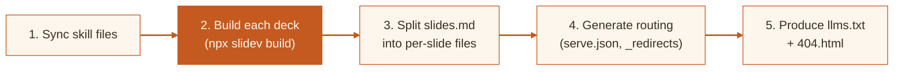

# Slide Maker

How decks get built and shipped -- from Markdown to production.

<style>
  .slidev-layout {
    background: #fdf6ec;
    color: #3b2f20;
  }
  .slidev-layout h1 {
    font-family: 'Young Serif', serif;
    color: #c45a20;
    font-size: 2.8em;
    line-height: 1.15;
  }
  .slidev-layout p {
    color: #6b5744;
    font-size: 1.2em;
    margin-top: 0.75em;
  }
</style>

---
transition: slide-left
---

# Project Anatomy

A skill-driven monorepo where the canonical source lives in `skills/slide-maker/` and decks live in `examples/`.

<br>

| Directory | Purpose |
|-----------|---------|
| `skills/slide-maker/` | Canonical components, composables, styles, and spec docs |
| `examples/demo/` | Core demo deck (published as `/slide-maker/`) |
| `examples/reference/` | Reference deck (published as `/reference/`) |
| `examples/build.sh` | Unified build orchestrator |
| `examples/index.html` | Deck gallery landing page |
| `examples/view.html` | Mobile-friendly Markdown slide viewer |

<br>

The skill directory is the **single source of truth** -- shared Vue components like `AudienceQRCode`, `KeyboardHelp`, composables like `useSections`, and CSS transitions are copied into each deck at build time.

<style>
  .slidev-layout {
    background: #fdf6ec;
    color: #3b2f20;
  }
  .slidev-layout h1 {
    font-family: 'Young Serif', serif;
    color: #c45a20;
  }
  .slidev-layout table {
    font-size: 0.82em;
  }
  .slidev-layout th {
    background: #f5e6d0;
    color: #c45a20;
    font-weight: 600;
  }
  .slidev-layout td {
    border-bottom: 1px solid #e8d5bf;
  }
  .slidev-layout code {
    background: #f5e6d0;
    color: #9e4a12;
    padding: 0.1em 0.35em;
    border-radius: 3px;
    font-size: 0.9em;
  }
  .slidev-layout strong {
    color: #c45a20;
  }
</style>

---
transition: slide-left
---

# The Build Pipeline

`npm run build` triggers `examples/build.sh`, which orchestrates everything in five stages.



<br>

**Sync** copies components, composables, and styles from `skills/slide-maker/` into each deck so they work standalone. **Split** uses an inline Python script to parse Slidev Markdown into `slides/1.md`, `slides/2.md`, etc., resolving `src:` imports. The build also supports **external decks** via a `DECKS_DIR` environment variable.

<style>
  .slidev-layout {
    background: #fdf6ec;
    color: #3b2f20;
  }
  .slidev-layout h1 {
    font-family: 'Young Serif', serif;
    color: #c45a20;
  }
  .slidev-layout code {
    background: #f5e6d0;
    color: #9e4a12;
    padding: 0.1em 0.35em;
    border-radius: 3px;
    font-size: 0.9em;
  }
  .slidev-layout strong {
    color: #c45a20;
  }
</style>

---
transition: slide-left
---

# Deployment: Push to Main, Done

GitHub Actions handles CI/CD via `.github/workflows/deploy.yml`.

<br>

```yaml
# Simplified view of the workflow
on:
  push:
    branches: [main]
jobs:
  build:
    steps:
      - npm ci
      - bash examples/build.sh        # BASE_PREFIX=/slide-maker
      - upload-pages-artifact          # path: examples/_build
  deploy:
    needs: build
    steps:
      - deploy-pages                   # GitHub Pages environment
```

<br>

The build sets `BASE_PREFIX=/slide-maker` so Slidev generates correct asset paths for the GitHub Pages subdirectory. The output at `examples/_build/` also includes `_redirects` for Cloudflare Pages and `serve.json` for local preview -- **three hosting targets from one build**.

<style>
  .slidev-layout {
    background: #fdf6ec;
    color: #3b2f20;
  }
  .slidev-layout h1 {
    font-family: 'Young Serif', serif;
    color: #c45a20;
  }
  .slidev-layout pre {
    background: #3b2f20;
    color: #f5e6d0;
    border-radius: 8px;
    font-size: 0.82em;
  }
  .slidev-layout code {
    background: #f5e6d0;
    color: #9e4a12;
    padding: 0.1em 0.35em;
    border-radius: 3px;
    font-size: 0.9em;
  }
  .slidev-layout pre code {
    background: transparent;
    color: #f5e6d0;
    padding: 0;
  }
  .slidev-layout strong {
    color: #c45a20;
  }
</style>

---
layout: center
transition: fade
---

# What Makes This Different

<br>

<div style="display: grid; grid-template-columns: 1fr 1fr; gap: 2rem; max-width: 720px; margin: 0 auto;">
<div>

**Skill as canon** -- shared code lives in one place and gets synced into decks, not duplicated.

**Per-slide API** -- the split step produces individually fetchable `slides/N.md` files and an `llms.txt` manifest.

</div>
<div>

**Multi-target output** -- a single `build.sh` produces routing configs for GitHub Pages, Cloudflare, and local `serve`.

**Fallback viewer** -- `view.html` renders Markdown slides on mobile without loading the full Slidev SPA.

</div>
</div>

<br>

<div style="text-align: center; color: #9e7a56; font-size: 0.9em;">

Built with Slidev, orchestrated by Bash, deployed by GitHub Actions.

</div>

<style>
  .slidev-layout {
    background: #fdf6ec;
    color: #3b2f20;
  }
  .slidev-layout h1 {
    font-family: 'Young Serif', serif;
    color: #c45a20;
    font-size: 2.2em;
  }
  .slidev-layout strong {
    color: #c45a20;
  }
  .slidev-layout code {
    background: #f5e6d0;
    color: #9e4a12;
    padding: 0.1em 0.35em;
    border-radius: 3px;
    font-size: 0.9em;
  }
</style>
