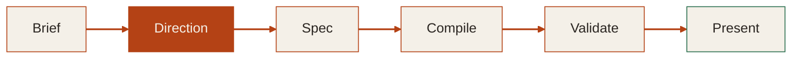

# The fix: decide direction before writing a single slide

**Direction** is step two — before the spec, before any slides exist. By the time compilation starts, the deck already has a voice.

<!-- The flowchart shows the full user journey: brief (what you want to say), direction (how it should look and feel), spec (the structured plan), compile (Markdown generation), validate (WCAG checks, LLM-tell audit, screenshot review), present. The bold highlight on Direction is the key insight. This is the anti-generic mechanism. No edge labels because Mermaid renders them as black boxes; every node has explicit inline style. -->
